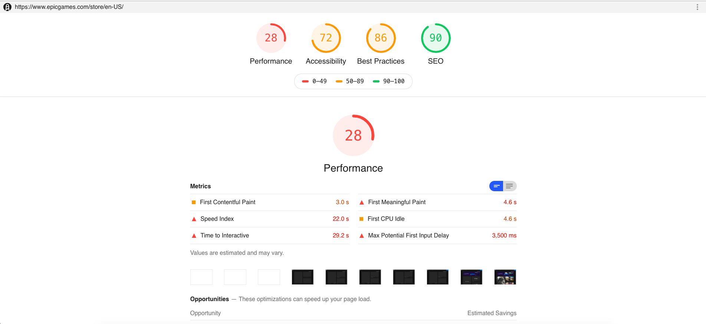

#  Lighthouse reports
Generate Google Lighthouse reports to measure performance, accessibility and security.

### What is Lighthouse?
[Google Lighthouse](https://developers.google.com/web/tools/lighthouse/) is an open-source, automated tool for improving the quality of web pages. You can run it against any web page, public or requiring authentication. It has audits for performance, accessibility, progressive web apps, and more.

### Run

`npm run report  -- --url='https://developer.mozilla.org/' `